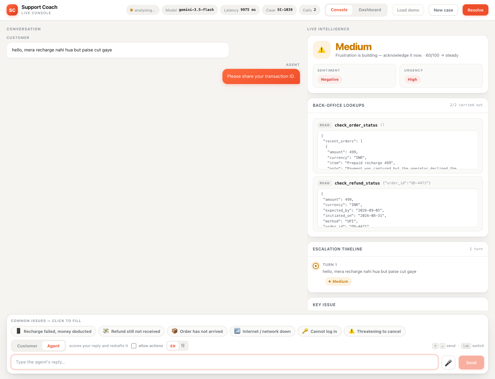
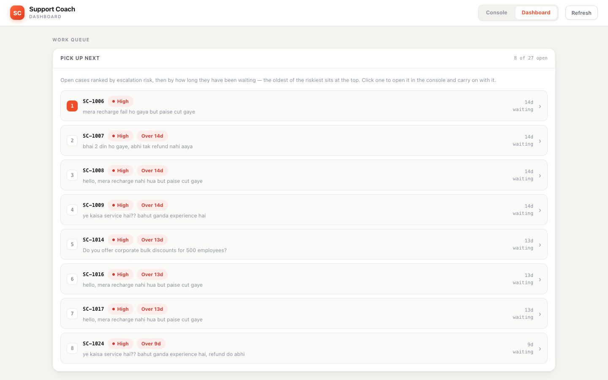

<div align="center">


### Real-time coaching for customer support agents — built for how India actually writes

[](https://github.com/YOUR-USERNAME/support-coach/actions/workflows/ci.yml)
[](https://www.python.org/)
[](LICENSE)
[](https://ai.google.dev/)
[](https://docs.astral.sh/ruff/)

**Reads the customer's mood as the chat happens · Looks up the real order · Drafts the reply · Scores the agent**

[Quick start](#quick-start) · [Why this exists](#why-this-exists) · [Architecture](#architecture) · [Contributing](CONTRIBUTING.md)

</div>

---

## Why this exists

Off-the-shelf sentiment analysis is measurably wrong on Hinglish, and that is not a rounding
error — it is the difference between catching an angry customer and ignoring them.

Give a standard multilingual sentiment model this line, typed by a customer who is plainly furious:

```
bahut ganda service hai
```

> **`POSITIVE` — confidence 49.8%**

The customer said "the service is very bad." The model called it positive. An escalation tracker
built on that signal stays green while the customer walks away.

The same sentence, read by this project's Gemini-backed analyser **with the conversation around it**:

> **`negative` · frustration 85/100 · escalation risk `high`**

That gap is the whole project. Both results are reproduced, with their outputs saved, in
[`customer_support_coach.ipynb`](customer_support_coach.ipynb) — Step 13 (English) and Step 17
(Hinglish). The tracker was never the problem. **The signal was.**

---

## What it does



As a conversation happens, every customer turn is analysed and every agent turn is scored.

| | |
|---|---|
| 🎯 **Conversation-aware analysis** | Sentiment, urgency and escalation risk judged over the **whole thread**, not one line at a time. A calmly-worded message scores 50 alone but 85 in context, because the customer is repeating a problem nobody fixed. |
| 🔎 **Real back-office lookups** | Gemini function calling against a mock order system. It chains: reads the failed recharge, then looks up that order's refund — so the draft quotes `RF-9012, expected by 5 Sep`, not "we're looking into it." |
| 📚 **Semantic knowledge base** | Gemini embeddings + cosine similarity. Keyword matching answered 8 of 12 paraphrased questions; semantic search answers **12 of 12**. Threshold `0.58`, measured rather than guessed. |
| 🛡️ **PII redaction** | Phone numbers, emails, order ids and card numbers are replaced with placeholders *before* anything reaches Gemini — chat **and** embeddings — then restored in the reply. |
| ✍️ **Drafted replies** | Grounded in the matched help article and the real lookup result, rated 👍/👎 by the agent. |
| 📊 **Agent scorecard** | Tone, empathy and clarity, 1–10 against a published rubric. |
| ⚡ **Auto-resolution** | A confident KB match (≥ `0.65`) on a low-risk case answers the customer directly and closes it. |
| ⏱️ **SLA tracking** | Targets that vary by risk — high 15 min, medium 1 h, low 4 h — with a "breaching soon" panel. |
| 🎙️ **Voice input** | Browser speech recognition, English or Hindi. No extra service, no extra cost. |

### The dashboard



Work queue (riskiest and oldest first) · deflection rate · SLA breaches · issues over day ·
agent performance over time · suggestion acceptance · and **"questions we cannot answer"** —
the list of help articles someone still needs to write.

---

## Quick start

> **Prerequisites:** Python 3.11+ and a free [Gemini API key](https://aistudio.google.com/apikey)
> (no credit card).

```bash
git clone https://github.com/YOUR-USERNAME/support-coach.git
cd support-coach

python3 -m venv .venv && source .venv/bin/activate   # Windows: .venv\Scripts\activate
pip install -r requirements.txt

cp gemini_api_key.example.txt gemini_api_key.txt     # then paste your key after the "="
cp orders.example.json orders.json                   # the mock order system

python3 app/server.py
```

Open **<http://127.0.0.1:5001>** and press **Load demo**.

<details>
<summary><b>Running the notebook instead</b></summary>

The notebook is the source of truth for the coaching engine and carries the full write-up —
the Hinglish finding, the threshold measurements and the before/after comparisons.

```bash
pip install -r requirements-dev.txt jupyter
jupyter notebook customer_support_coach.ipynb
```

Run the cells in order; Step 1 installs `transformers` and `torch` itself. It also runs in
Google Colab, where the key is read from Colab secrets.
</details>

<details>
<summary><b>The port is already in use</b></summary>

```bash
PORT=8080 python3 app/server.py
```
</details>

---

## Configuration

The API key is resolved in this order — the first one found wins.

| # | Source | How to set it |
|---|---|---|
| 1 | Environment variable | `export GEMINI_API_KEY="..."` |
| 2 | Key file | `gemini_api_key.txt` (also accepts `gemini_key.txt`, `api_key.txt`, `.env`) |
| 3 | Colab secret | Add `GEMINI_API_KEY` in the Colab sidebar |
| 4 | Prompt | Typed in when nothing else is found |

### Environment variables

| Variable | Default | What it does |
|---|---|---|
| `GEMINI_API_KEY` | — | Your key. **Never commit it.** |
| `GEMINI_MODEL` | `gemini-3.5-flash` | Generation model. Falls back to `gemini-3.5-flash-lite` on a rate limit. |
| `PORT` | `5001` | Port for the Flask app. |

### Tuning

These live in the code, next to a comment explaining how each number was arrived at.

| Constant | Default | Where | Meaning |
|---|---|---|---|
| `SEMANTIC_THRESHOLD` | `0.58` | `app/coach_core.py` | Cosine similarity for a help article to count as a match. True matches measured 0.596–0.711, unanswerable ones never got above 0.559. |
| `AUTO_RESOLVE_THRESHOLD` | `0.65` | `app/server.py` | Confidence needed to answer the customer with no agent at all — deliberately higher than the threshold used merely to *show* an article. |
| `SLA_TARGET_MINUTES` | `{high: 15, medium: 60, low: 240}` | `app/server.py` | First-response target by escalation risk. |
| `allow_writes` | `False` | runtime toggle | Refunds and password resets are **requested, not run**, until a person approves them. |

---

## Architecture

```
                    customer_support_coach.ipynb
                     (the source of truth — 37 cells)
                                  │
                       python3 app/build_core.py
                                  │
                                  ▼
  ┌──────────────┐        ┌──────────────────┐        ┌──────────────────┐
  │   Browser    │◄──────►│  app/server.py   │◄──────►│ app/coach_core.py│
  │  console +   │  JSON  │  Flask · routes  │        │    GENERATED     │
  │  dashboard   │        │  SLA · analytics │        │  AICoach engine  │
  └──────────────┘        └────────┬─────────┘        └────────┬─────────┘
                                   │                           │
                            ┌──────▼──────┐        ┌───────────▼──────────┐
                            │  cases.db   │        │   Gemini API         │
                            │  (SQLite)   │        │ chat · embeddings ·  │
                            └─────────────┘        │  function calling    │
                                                   └───────────┬──────────┘
                                                               │
                                                    ┌──────────▼─────────┐
                                                    │  orders.json       │
                                                    │  mock back office  │
                                                    └────────────────────┘
```

> [!IMPORTANT]
> **`app/coach_core.py` is generated. Do not edit it by hand.**
> Change the notebook, then run `python3 app/build_core.py`. CI regenerates the file and fails
> the build if it differs from what was committed, so the notebook and the app can never
> quietly disagree.

Full walkthrough: **[docs/architecture.md](docs/architecture.md)**.

### Project layout

```
.
├── customer_support_coach.ipynb   # source of truth: engine + the written analysis
├── app/
│   ├── build_core.py              # notebook  ──►  coach_core.py
│   ├── coach_core.py              # GENERATED — AICoach, KB, redaction, tools
│   ├── server.py                  # Flask: routes, SLA, analytics, SQLite store
│   └── static/
│       ├── index.html             # live console
│       └── dashboard.html         # dashboard
├── tests/                         # pytest — runs with NO API key
├── docs/
├── .github/workflows/ci.yml       # tests · lint · notebook-sync · secret scan
├── orders.example.json            # copy to orders.json
└── gemini_api_key.example.txt     # copy to gemini_api_key.txt
```

---

## Tests

The suite runs **without an API key** — anything that would call Gemini is driven with fixed
inputs or stubbed, so a fresh clone and a fork's pull request both run it in full.

```bash
pip install -r requirements-dev.txt
pytest tests/ -v
```

```
79 passed, 2 skipped
```

Covering redaction round-trips, SLA maths, the SQLite store and its JSON migration, the
analytics, knowledge-base matching, the back-office tools, and the function-calling loop.

---

## Security

- `gemini_api_key.txt`, `app/cases.db` and `orders.json` are git-ignored — they hold secrets or
  real transcripts. The repo ships `.example` files instead.
- Customer text is redacted before it reaches Gemini, on both the chat and embeddings paths.
- Write-capable tools never fire on their own: `issue_refund` and `send_password_reset` are
  recorded as *requested* and wait for a human.
- CI greps every commit for API-key patterns and fails if one appears.

Found a problem? See **[SECURITY.md](SECURITY.md)**.

---

## Contributing

Issues and pull requests are welcome — start with **[CONTRIBUTING.md](CONTRIBUTING.md)**, which
covers the notebook-first workflow (the one rule that trips everybody up), Conventional Commits
and the branching model. Everyone is expected to follow the
**[Code of Conduct](CODE_OF_CONDUCT.md)**.

## License

[MIT](LICENSE) © Aman
